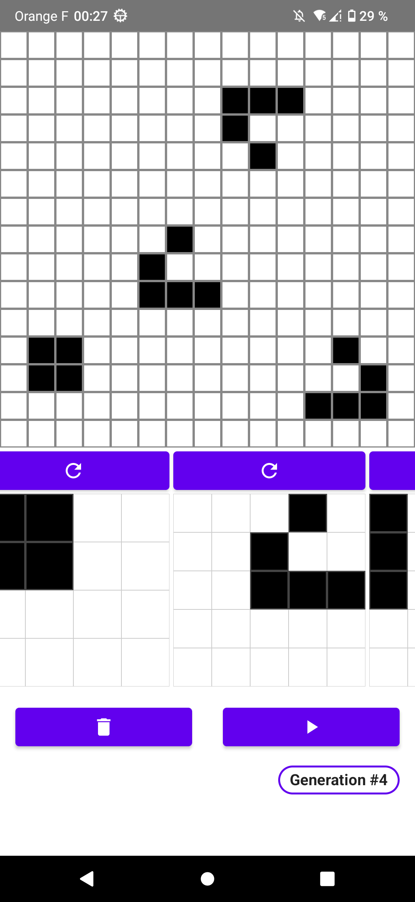

 

    

<h3 align="center">Jeu de la Vie ANDROID</h3>

# Jeu de la vie

Jeu de la vie en Kotlin. Les cellules sont des objets distincts et non des cases d'un tableau.

Il est possible de Drag & Drop des patterns dans la grille.

